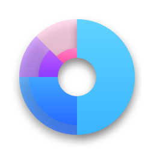

<a id="readme-top"></a>

<!-- PROJECT SHIELDS -->
[![Contributors][contributors-shield]][contributors-url]
[![Forks][forks-shield]][forks-url]
[![Stargazers][stars-shield]][stars-url]
[![Issues][issues-shield]][issues-url]
[![MIT License][license-shield]][license-url]

<!-- PROJECT LOGO -->
<br />
<div align="center">
  <a href="https://github.com/kyurem39/bkspace">
    
  </a>

  <h3 align="center">BK Space</h3>

  <p align="center">
    Trạm lưu trữ cá nhân & truyền nhận file / ghi chú nhanh chóng qua mạng nội bộ hoặc máy chủ tự host.
    <br />
    <a href="https://kyurem39.github.io/bkspace/" target="_blank" rel="noopener noreferrer"><strong>Trải nghiệm Demo Trực Tiếp »</strong></a>
    <br />
    <br />
    <a href="https://github.com/kyurem39/bkspace">Mã nguồn</a>
    &middot;
    <a href="https://github.com/kyurem39/bkspace/issues/new?labels=bug">Báo lỗi</a>
    &middot;
    <a href="https://github.com/kyurem39/bkspace/issues/new?labels=enhancement">Yêu cầu tính năng</a>
  </p>
</div>

<!-- TABLE OF CONTENTS -->
<details>
  <summary>Mục lục</summary>
  <ol>
    <li>
      <a href="#về-dự-án">Về dự án</a>
      <ul>
        <li><a href="#công-nghệ-sử-dụng">Công nghệ sử dụng</a></li>
      </ul>
    </li>
    <li><a href="#tính-năng-nổi-bật">Tính năng nổi bật</a></li>
    <li>
      <a href="#bắt-đầu">Bắt đầu</a>
      <ul>
        <li><a href="#yêu-cầu-hệ-thống">Yêu cầu hệ thống</a></li>
        <li><a href="#cài-đặt--triển-khai">Cài đặt & Triển khai</a></li>
      </ul>
    </li>
    <li><a href="#hướng-dẫn-sử-dụng">Hướng dẫn sử dụng</a></li>
    <li><a href="#đóng-góp">Đóng góp</a></li>
    <li><a href="#giấy-phép">Giấy phép</a></li>
    <li><a href="#liên-hệ">Liên hệ</a></li>
  </ol>
</details>

<!-- ABOUT THE PROJECT -->
## Về dự án

**BK Space** là một giải pháp tự host (self-hosted) tối giản, siêu nhẹ dùng để chia sẻ file, sao lưu tài liệu và thả nhanh các đoạn văn bản (quick notes) giữa các thiết bị cá nhân (PC, Laptop, Smartphone) trong cùng mạng LAN hoặc môi trường đám mây riêng biệt mà không phụ thuộc vào bất kỳ dịch vụ bên thứ ba nào.

### Công nghệ sử dụng

* [![PHP][PHP.net]][PHP-url]
* [![JavaScript][JavaScript.com]][JS-url]
* [![HTML5][HTML5.org]][HTML-url]
* [![CSS3][CSS3.org]][CSS-url]

<p align="right">(<a href="#readme-top">về đầu trang</a>)</p>

<!-- FEATURES -->
## Tính năng nổi bật

- **Tải lên tức thì:** Hỗ trợ kéo - thả file (drag & drop) với giới hạn linh hoạt (15MB/file, hạn mức tổng 5GB).
- **Thả ghi chú nhanh (Text Drop):** Nhập và lưu trực tiếp văn bản/clipboard giữa các thiết bị mà không cần tạo file thủ công.
- **Quản lý file thông minh:** Hiển thị chi tiết dung lượng, ngày sửa đổi, sắp xếp theo tên / ngày / kích thước theo thứ tự tăng/giảm.
- **Thao tác hàng loạt:** Hỗ trợ chọn tất cả, tải về hàng loạt (đóng gói ZIP) và xóa hàng loạt an toàn.
- **Giao diện hiện đại & Chủ đề kép:** Hỗ trợ Dark Mode / Light Mode lưu trạng thái tự động.
- **Tương thích cao:** Dễ dàng chạy trên PHP local (mạng LAN) hoặc deploy lên các dịch vụ web hosting như [InfinityFree](https://www.infinityfree.com/).
- **Không cần cơ sở dữ liệu (No-DB):** Hoạt động trực tiếp trên hệ thống file phẳng (flat filesystem) của PHP, dễ dàng sao lưu hoặc di chuyển.

<p align="right">(<a href="#readme-top">về đầu trang</a>)</p>

<!-- GETTING STARTED -->
## Bắt đầu

### Yêu cầu hệ thống

* PHP >= 7.4 (hoặc PHP 8.x) đã bật extension `zip` và quyền ghi thư mục.
* Máy chủ web Apache/Nginx (hoặc chạy trực tiếp bằng PHP Built-in Server).

### Cài đặt & Triển khai

#### 1. Chạy trên môi trường Local / Mạng nội bộ
1. Clone mã nguồn về máy:
   ```sh
   git clone https://github.com/kyurem39/bkspace.git
   cd bkspace
   ```
2. Đảm bảo thư mục lưu trữ `uploads/` có quyền ghi:
   ```sh
   chmod 755 uploads
   ```
3. Chạy nhanh bằng máy chủ tích hợp sẵn của PHP:
   ```sh
   php -S 0.0.0.0:8000
   ```
4. Mở trình duyệt và truy cập:
   `http://localhost:8000` (hoặc qua IP mạng LAN từ thiết bị khác: `http://<dia-chi-ip>:8000`).

#### 2. Triển khai Web Hosting (Đã kiểm nghiệm thực tế)
* **[InfinityFree](https://www.infinityfree.com/)**: Đã được thử nghiệm và hoạt động mượt mà trên nền tảng lưu trữ web miễn phí InfinityFree (hỗ trợ sẵn PHP và Apache với cấu hình `htaccess` có trong repo). Chỉ cần tải toàn bộ mã nguồn lên thư mục `htdocs` trên File Manager / FTP của hosting.

#### 3. Trải nghiệm Demo trực tiếp trên GitHub Pages
* Xem ngay tại: <a href="https://kyurem39.github.io/bkspace/" target="_blank" rel="noopener noreferrer"><strong>https://kyurem39.github.io/bkspace/</strong></a>
* *(Bản GitHub Pages hoạt động ở **Chế độ Demo Tương tác**, cho phép bạn trải nghiệm trực quan giao diện kéo-thả, gửi ghi chú văn bản, duyệt và quản lý file mô phỏng ngay trên trình duyệt mà không cần cài đặt PHP).*

<p align="right">(<a href="#readme-top">về đầu trang</a>)</p>

<!-- USAGE EXAMPLES -->
## Hướng dẫn sử dụng

1. **Gửi file:** Kéo file vào vùng "Kéo & thả file vào đây" hoặc bấm chọn file để tải lên.
2. **Gửi ghi chú:** Nhập nội dung vào ô văn bản và bấm gửi để lưu nhanh thành file text.
3. **Tải file:** Nhấp trực tiếp vào file hoặc tick chọn nhiều file rồi bấm **Tải các mục đã chọn (.zip)**.
4. **Xóa:** Chọn các file cần xóa và xác nhận thao tác.

<p align="right">(<a href="#readme-top">về đầu trang</a>)</p>

<!-- CONTRIBUTING -->
## Đóng góp

Mọi đóng góp nhằm cải thiện BK Space đều được hoan nghênh:

1. Fork dự án
2. Tạo nhánh tính năng mới (`git checkout -b feature/TinhNangMoi`)
3. Commit các thay đổi (`git commit -m 'Add: Thêm tính năng mới'`)
4. Push lên nhánh (`git push origin feature/TinhNangMoi`)
5. Mở một Pull Request

<p align="right">(<a href="#readme-top">về đầu trang</a>)</p>

<!-- LICENSE -->
## Giấy phép

Phân phối dưới giấy phép MIT License. Xem `LICENSE` để biết thêm chi tiết.

<p align="right">(<a href="#readme-top">về đầu trang</a>)</p>

<!-- CONTACT -->
## Liên hệ

**kyurem39** - khanhpe39@gmail.com  
Project Link: [https://github.com/kyurem39/bkspace](https://github.com/kyurem39/bkspace)

<p align="right">(<a href="#readme-top">về đầu trang</a>)</p>

<!-- MARKDOWN LINKS & IMAGES -->
[contributors-shield]: https://img.shields.io/github/contributors/kyurem39/bkspace.svg?style=for-the-badge
[contributors-url]: https://github.com/kyurem39/bkspace/graphs/contributors
[forks-shield]: https://img.shields.io/github/forks/kyurem39/bkspace.svg?style=for-the-badge
[forks-url]: https://github.com/kyurem39/bkspace/network/members
[stars-shield]: https://img.shields.io/github/stars/kyurem39/bkspace.svg?style=for-the-badge
[stars-url]: https://github.com/kyurem39/bkspace/stargazers
[issues-shield]: https://img.shields.io/github/issues/kyurem39/bkspace.svg?style=for-the-badge
[issues-url]: https://github.com/kyurem39/bkspace/issues
[license-shield]: https://img.shields.io/github/license/kyurem39/bkspace.svg?style=for-the-badge
[license-url]: https://github.com/kyurem39/bkspace/blob/main/LICENSE
[PHP.net]: https://img.shields.io/badge/PHP-777BB4?style=for-the-badge&logo=php&logoColor=white
[PHP-url]: https://www.php.net/
[JavaScript.com]: https://img.shields.io/badge/JavaScript-F7DF1E?style=for-the-badge&logo=javascript&logoColor=black
[JS-url]: https://developer.mozilla.org/en-US/docs/Web/JavaScript
[HTML5.org]: https://img.shields.io/badge/HTML5-E34F26?style=for-the-badge&logo=html5&logoColor=white
[HTML-url]: https://developer.mozilla.org/en-US/docs/Web/HTML
[CSS3.org]: https://img.shields.io/badge/CSS3-1572B6?style=for-the-badge&logo=css3&logoColor=white
[CSS-url]: https://developer.mozilla.org/en-US/docs/Web/CSS
